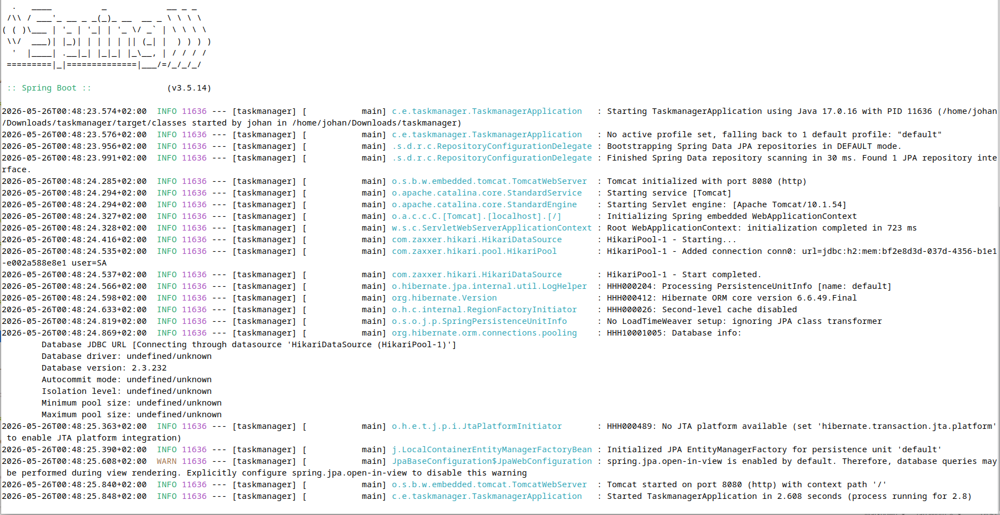
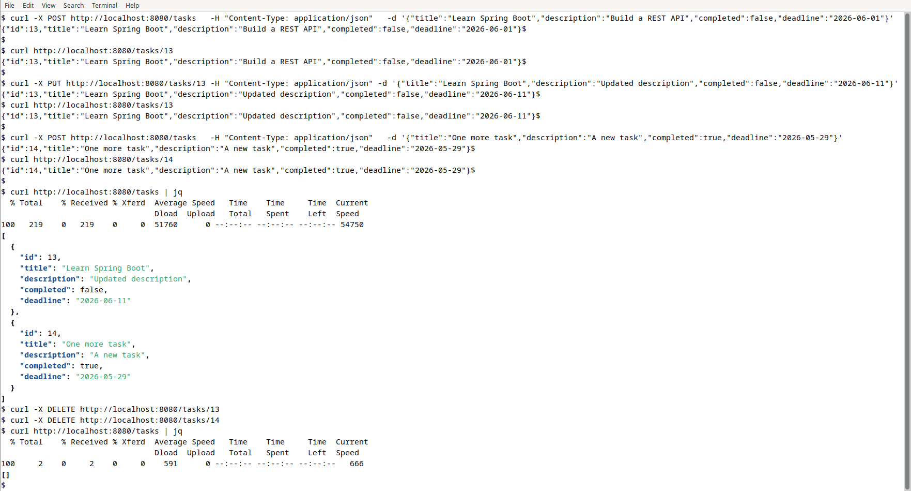
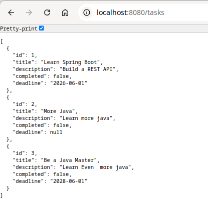

# Task Manager API

A RESTful task management API built with Spring Boot, created as a learning project to explore backend development with Java, Spring, and JPA.

This is an evolving project: it currently covers task CRUD and user accounts with a one-to-many relationship, and will be extended with authentication and a frontend as I progress through my studies.

## Features

- Create, read, update and delete tasks (full CRUD)
- Each task has a title, description, completion status and deadline
- User accounts, where each task belongs to a user (one-to-many relationship)
- Fetch all tasks belonging to a specific user
- Custom query methods for filtering tasks (by completion status, deadline, and owner)
- Proper HTTP status codes (e.g. `404 Not Found` for missing tasks, `204 No Content` on delete)
- In-memory H2 database for fast, zero-setup development

## Tech stack

- **Java 17**
- **Spring Boot 3.5.14** (Spring Web, Spring Data JPA)
- **H2** in-memory database
- **Maven** for build and dependency management

## Architecture

The project follows a standard layered architecture:

```
com.example.taskmanager
├── TaskmanagerApplication   # Application entry point
├── model/                   # Data models (Task, TaskUser)
├── repository/              # Database access (Spring Data JPA)
├── service/                 # Business logic
└── controller/              # REST endpoints (HTTP layer)
```

A request flows from the **controller** (receives the HTTP call) to the **service** (business logic) to the **repository** (database access), keeping each layer focused on a single responsibility. A `Task` references the `TaskUser` it belongs to via a `@ManyToOne` relationship, stored as a foreign key.

## API endpoints

### Tasks

| Method | Endpoint        | Description              |
| ------ | --------------- | ------------------------ |
| GET    | `/tasks`        | Get all tasks            |
| GET    | `/tasks/{id}`   | Get a single task by id  |
| POST   | `/tasks`        | Create a new task        |
| PUT    | `/tasks/{id}`   | Update an existing task  |
| DELETE | `/tasks/{id}`   | Delete a task            |

### Users

| Method | Endpoint               | Description                       |
| ------ | ---------------------- | --------------------------------- |
| GET    | `/users`               | Get all users                     |
| GET    | `/users/{id}`          | Get a single user by id           |
| POST   | `/users`               | Create a new user                 |
| PUT    | `/users/{id}`          | Update an existing user           |
| DELETE | `/users/{id}`          | Delete a user                     |
| GET    | `/users/{id}/tasks`    | Get all tasks for a specific user |

## Running the application

### Requirements

- Java 17 or higher
- Maven (or use the included Maven wrapper)

### Start the app

```bash
./mvnw spring-boot:run
```

The application starts on `http://localhost:8080`.

> **Note:** the H2 database runs in-memory, so all data is reset every time the application restarts. This is intentional for development.

## Example usage

Create a task:

```bash
curl -X POST http://localhost:8080/tasks \
  -H "Content-Type: application/json" \
  -d '{"title":"Learn Spring Boot","description":"Build a REST API","completed":false,"deadline":"2026-06-01"}'
```

Get all tasks:

```bash
curl http://localhost:8080/tasks
```

Update a task:

```bash
curl -X PUT http://localhost:8080/tasks/1 \
  -H "Content-Type: application/json" \
  -d '{"title":"Learn Spring Boot","description":"Updated description","completed":true,"deadline":"2026-06-15"}'
```

Delete a task:

```bash
curl -X DELETE http://localhost:8080/tasks/1
```

Create a user, then create a task that belongs to them:

```bash
curl -X POST http://localhost:8080/users \
  -H "Content-Type: application/json" \
  -d '{"username":"johan"}'

curl -X POST http://localhost:8080/tasks \
  -H "Content-Type: application/json" \
  -d '{"title":"Min uppgift","completed":false,"deadline":"2026-06-01","user":{"userid":1}}'
```

Get all tasks for a specific user:

```bash
curl http://localhost:8080/users/1/tasks
```

## Screenshots

### Application startup

The app boots with Spring Boot's embedded Tomcat server and connects to an in-memory H2 database.



### Full CRUD cycle via curl

Creating, reading, updating and deleting tasks through the API, ending with an empty list after deletion.



### Retrieving all tasks in the browser

A GET request to `/tasks` returns all stored tasks as JSON.



## Roadmap

Planned improvements as the project grows:

- [x] User accounts with a one-to-many relationship to tasks
- [ ] Authentication and authorization with Spring Security (so users only see their own tasks)
- [ ] Input validation and centralized error handling
- [ ] Filtering, sorting and priorities for tasks
- [ ] Migrate from H2 to PostgreSQL
- [ ] API documentation with Swagger
- [ ] A frontend interface

## About

A learning project for backend development with Java and Spring Boot.
