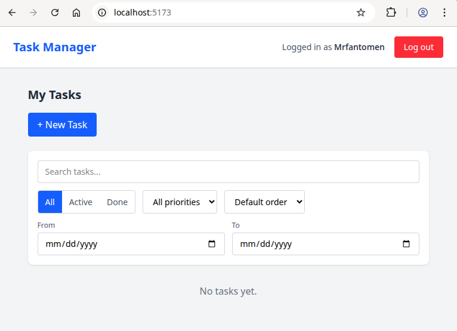
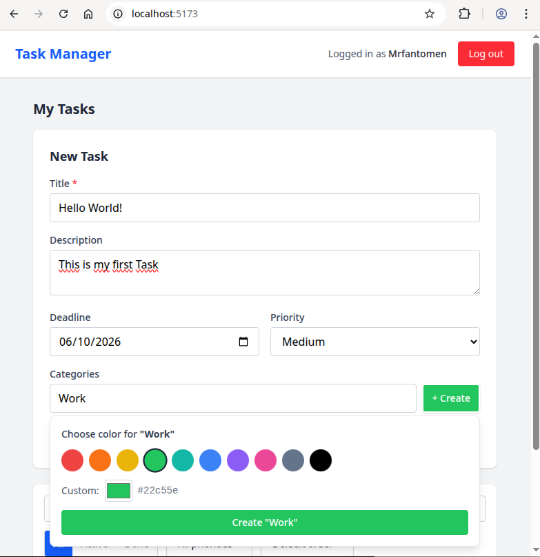
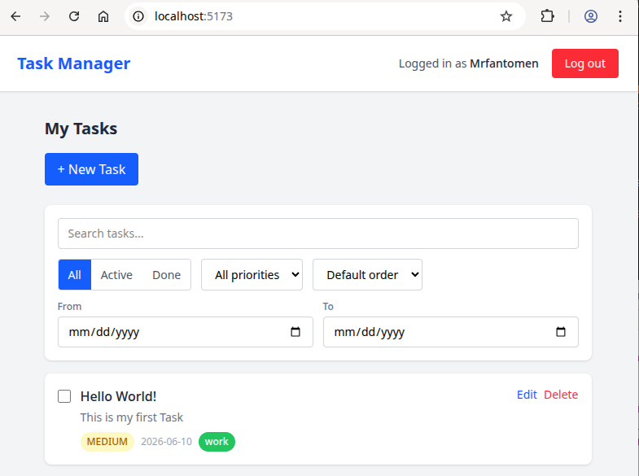

# Task Manager

A full-stack task management application built with Spring Boot and React, created as a learning project to explore backend and frontend development with Java, Spring, and modern JavaScript.

This is an evolving project: it currently covers a complete REST API with authentication, task and category management, role-based access control, and a React frontend with session-based login, filtering, sorting and full CRUD. It will be extended with task sharing and multi-factor authentication as the project grows.

## Features

### Backend
- Create, read, update and delete tasks (full CRUD)
- Each task has a title, description, completion status, deadline, priority and categories
- User accounts, where each task belongs to a user (one-to-many relationship)
- User registration with Argon2id password hashing (OWASP-recommended)
- Session-based authentication with `POST /auth/login`, `POST /auth/logout` and `GET /auth/me`
- Authentication and authorization with Spring Security (users only see their own tasks — list, get, update and delete)
- Object-level authorization (BOLA/IDOR protection): tasks are always scoped to the authenticated user
- Server-side task ownership (the API ignores any user supplied in the request body and uses the authenticated user)
- Password hashes are never exposed in API responses (dedicated response DTOs for all entities)
- Centralized error handling via `@ControllerAdvice` with consistent JSON error responses
- CSRF protection via `CookieCsrfTokenRepository` for browser-based session flow
- **Priority** as a typed enum (`LOW`, `MEDIUM`, `HIGH`) — invalid values are rejected with `400 Bad Request`
- **Categories** as their own entity, owned per user (`@ManyToMany` relationship between tasks and categories), with color support
- **Filtering** tasks via query parameters — supports combining multiple filters: `?completed=`, `?dueBefore=`, `?priority=`, combinable via Spring Data `Specification`
- **Sorting** tasks via `?sortBy=`, validated against an allow-list (reusable `SortValidator` class)
- **Business rules**: titles are required, cannot be only whitespace, max 200 chars; deadlines cannot be in the past
- Category names are normalized on save (lowercased, trimmed) so `"Work"` and `"  WORK  "` are the same category
- Proper HTTP status codes (e.g. `201 Created` on registration, `400 Bad Request` for invalid input, `409 Conflict` for duplicate category names, `404 Not Found` for missing resources, `204 No Content` on delete)
- Seed data on startup (dev profile only) so users `johan`, `anna` and `admin` exist with categories and tasks without manual setup
- **PostgreSQL** support via Docker for persistent storage (prod profile)
- **Swagger / OpenAPI** documentation available at `/swagger-ui.html`
- **Role-based access control**: users have a `USER` or `ADMIN` role — admins can access `/admin/**` endpoints
- **Admin endpoints** under `/admin/**` protected by both request-level (`SecurityConfig`) and method-level (`@PreAuthorize`) security — defence in depth

### Frontend
- Login and logout with session-based authentication (cookies)
- Navbar showing the logged-in user and role (ADMIN badge for admin users)
- Task list with full CRUD: create, view, edit inline, delete, mark complete/incomplete
- Category management with a combobox — search existing, create new with a color picker
- Filtering tasks by: search (title), completion status (All/Active/Done), priority, date range
- Sorting tasks by: title, deadline, priority
- Color-coded priority badges and category pills

## Tech stack

### Backend
- **Java 17**
- **Spring Boot 3.5.14** (Spring Web, Spring Data JPA, Spring Security)
- **Argon2id** password hashing via **Bouncy Castle**
- **H2** in-memory database (dev profile)
- **PostgreSQL 16** via Docker (prod profile)
- **Springdoc OpenAPI** for Swagger UI
- **Maven** for build and dependency management

### Frontend
- **React 19** with **Vite 8**
- **Tailwind CSS v4** for styling
- Session-based auth with cookie handling (`credentials: include`)

## Architecture

The project is structured as a monorepo with separate `backend/` and `frontend/` directories.

### Backend

```
com.example.taskmanager
├── TaskmanagerApplication   # Application entry point
├── config/                  # SecurityConfig, DataSeeder, GlobalExceptionHandler, OpenApiConfig, CorsConfig
├── model/                   # Data models (Task, TaskUser, Category, Priority enum, Role enum)
├── dto/                     # Data transfer objects (RegisterRequest, TaskRequest, TaskResponse,
│                            #   TaskUserResponse, CategoryResponse, ErrorResponse)
├── repository/              # Database access (Spring Data JPA + Specification support)
├── service/                 # Business logic, authentication, validation, DTO mapping
├── controller/              # REST endpoints (TaskController, CategoryController,
│                            #   TaskUserController, AuthController, AdminController)
└── validation/              # Reusable validators (SortValidator, TaskSpecification)
```

A request flows from the **controller** (receives the HTTP call) to the **service** (business logic, validation and DTO mapping) to the **repository** (database access), keeping each layer focused on a single responsibility. Controllers return response DTOs — never raw JPA entities. Spring Security sits in front of the controller layer and rejects unauthenticated requests before they reach application code.

### Frontend

```
frontend/src
├── api.js                   # Central fetch wrapper (CSRF token, credentials, base URL)
├── App.jsx                  # Root component — handles auth state and routing
└── components/
    ├── Navbar.jsx            # Top navigation with logged-in user and logout
    ├── LoginPage.jsx         # Login form
    ├── TaskList.jsx          # Task list with filtering, sorting, create, edit, delete
    ├── CreateTaskForm.jsx    # New task form with category combobox
    ├── EditTaskForm.jsx      # Inline edit form
    ├── TaskFilters.jsx       # Search, status, priority, date range filters
    └── CategoryCombobox.jsx  # Search/create categories with color picker
```

## API endpoints

### Auth

| Method | Endpoint           | Description                                        |
| ------ | ------------------ | -------------------------------------------------- |
| POST   | `/auth/register`   | Register a new user (public)                       |
| POST   | `/auth/login`      | Log in (form data: `username`, `password`)         |
| POST   | `/auth/logout`     | Log out and invalidate the session                 |
| GET    | `/auth/me`         | Return the currently authenticated user and role   |

All other endpoints require authentication via session cookie (JSESSIONID).

### Tasks

All task endpoints require authentication. Requests are scoped to the authenticated user.

| Method | Endpoint        | Description                                       |
| ------ | --------------- | ------------------------------------------------- |
| GET    | `/tasks`        | Get all tasks belonging to the authenticated user. Supports query parameters: `completed`, `dueBefore` (ISO date), `priority` (`LOW`/`MEDIUM`/`HIGH`), `sortBy` (`id`/`title`/`deadline`/`completed`). Multiple filters can be combined. |
| GET    | `/tasks/{id}`   | Get a single task by id (scoped to authenticated user) |
| POST   | `/tasks`        | Create a new task (owned by the authenticated user). Body fields: `title`, `description`, `completed`, `deadline`, `priority`, `categoryIds` |
| PUT    | `/tasks/{id}`   | Update an existing task (same body fields as POST) |
| DELETE | `/tasks/{id}`   | Delete a task (scoped to authenticated user)       |

### Categories

All category endpoints require authentication. Categories are private per user.

| Method | Endpoint            | Description                              |
| ------ | ------------------- | ---------------------------------------- |
| GET    | `/categories`       | List the authenticated user's categories |
| GET    | `/categories/{id}`  | Get a single category by id              |
| POST   | `/categories`       | Create a new category (body: `name`, `color`). Names are normalized to lowercase and trimmed |
| DELETE | `/categories/{id}`  | Delete a category                        |

### Users

| Method | Endpoint               | Description                                    |
| ------ | ---------------------- | ---------------------------------------------- |
| POST   | `/users`               | Create a new user                              |
| PUT    | `/users/{id}`          | Update an existing user                        |
| DELETE | `/users/{id}`          | Delete a user                                  |

### Admin

All admin endpoints require the `ADMIN` role. Protected by both `SecurityConfig` and `@PreAuthorize`.

| Method | Endpoint                    | Description                              |
| ------ | --------------------------- | ---------------------------------------- |
| GET    | `/admin/users`              | List all users in the system             |
| GET    | `/admin/users/{id}`         | Get a specific user by id                |
| GET    | `/admin/users/{id}/tasks`   | Get all tasks for a specific user        |
| GET    | `/admin/tasks`              | List all tasks in the system             |
| GET    | `/admin/tasks/{id}`         | Get any task by id                       |

## Running the application

### Requirements

- Java 17 or higher
- Maven (or use the included Maven wrapper)
- Node.js 20 or higher (for the frontend)
- nvm recommended for managing Node versions

### Start the backend (dev profile — H2 in-memory database)

```bash
cd backend
./mvnw spring-boot:run
```

The backend starts on `http://localhost:8080`. The dev profile seeds three users automatically:

| Username | Password     | Role    |
| -------- | ------------ | ------- |
| `johan`  | `hemligt123` | `USER`  |
| `anna`   | `annapass123`| `USER`  |
| `admin`  | `admin123`   | `ADMIN` |

Johan gets a welcome task with categories and HIGH priority. Anna gets a medium priority task.

### Start the backend (prod profile — PostgreSQL)

First start the PostgreSQL container:

```bash
sudo docker start taskmanager-db
```

If the container does not exist yet, create it:

```bash
sudo docker run --name taskmanager-db \
  -e POSTGRES_DB=taskmanager \
  -e POSTGRES_USER=taskuser \
  -e POSTGRES_PASSWORD=taskpass \
  -p 5432:5432 \
  -d postgres:16
```

Then start the backend with the prod profile:

```bash
cd backend
./mvnw spring-boot:run -Dspring-boot.run.profiles=prod
```

Data persists across restarts when using PostgreSQL.

### Start the frontend

```bash
cd frontend
nvm use 24
npm install
npm run dev
```

The frontend starts on `http://localhost:5173`. Make sure the backend is running on `http://localhost:8080`.

### API documentation

Swagger UI is available at:

```
http://localhost:8080/swagger-ui.html
```

## Screenshots

### Login page


### Empty task list



### Creating a task with categories and color picker



### Task list with priority badge and category pill



## Roadmap

The project is built in steps, each adding a focused layer of functionality. Completed steps are checked off; remaining steps describe what is planned and roughly in what order.

### ✅ Step 1 — Core CRUD API

- [x] Task entity with title, description, completion status and deadline
- [x] Full CRUD endpoints for tasks
- [x] In-memory H2 database, layered architecture (controller → service → repository)

### ✅ Step 2 — Users and ownership

- [x] `TaskUser` entity
- [x] One-to-many relationship: each task belongs to a user
- [x] Endpoint to fetch all tasks for a specific user

### ✅ Step 3 — Authentication and authorization

- [x] Spring Security configured with `SecurityConfig`
- [x] User registration with Argon2id password hashing (OWASP-recommended)
- [x] Users only see their own tasks — on list, get, update and delete (object-level authorization fixed in Step 5)
- [x] Server-side task ownership on `POST` and `PUT` (the request body cannot override the owner)
- [x] Password hashes hidden from API responses

### ✅ Step 4 — Richer task logic

- [x] Filtering on `completed`, `dueBefore`, `priority`
- [x] Sorting via `?sortBy=`, with an allow-list validated by a reusable `SortValidator`
- [x] `Priority` enum (`LOW`, `MEDIUM`, `HIGH`) with automatic validation
- [x] `Category` as its own entity, private per user, with a many-to-many relationship to tasks
- [x] Business rules for task validation (required title, max length, no past deadlines)
- [x] Seed data on startup (dev profile only)

### ✅ Step 5 — Security hardening

- [x] **Object-level authorization (BOLA/IDOR fix)**: `GET /tasks/{id}`, `PUT /tasks/{id}` and `DELETE /tasks/{id}` are now scoped to the authenticated user via `findByIdAndUserUserid` and return `404` if the task is not yours.
- [x] **Safer task updates**: the existing task is now loaded and mutated rather than replaced with a new object built from the request body.
- [x] **Safer task deletion**: task ownership is verified before deletion.
- [x] **Remove or guard the `/users` endpoints**: `GET /users`, `GET /users/{id}` and `GET /users/{id}/tasks` now return `403 Forbidden` with a TODO comment until a proper admin role exists (Step 7).
- [x] **Document the chosen Argon2 parameters** in `SecurityConfig` with a comment explaining the OWASP recommendation.

### ✅ Step 6 — Polish and production-readiness

- [x] **Response DTOs**: controllers return dedicated response DTOs (`TaskResponse`, `TaskUserResponse`, `CategoryResponse`, `ErrorResponse`) — never raw JPA entities.
- [x] **Centralized error handling** via `GlobalExceptionHandler` (`@RestControllerAdvice`) with consistent JSON error responses including status, message and timestamp.
- [x] **Combining multiple filters** in one request via Spring Data `Specification` — e.g. `?completed=false&priority=HIGH` works correctly.
- [x] **Remove unused repository methods** (`findByCompleted`, `findByDeadline`, `findAll` without user scope).
- [x] **Replaced `System.out.println` with SLF4J logging**.
- [x] **Migrated from H2 to PostgreSQL** via Docker (prod profile) for persistent storage.
- [x] **API documentation with Swagger / OpenAPI** available at `/swagger-ui.html`.

### ✅ Step 7 — Admin role

- [x] Added `Role` enum (`USER`, `ADMIN`) and `role` field on `TaskUser` (defaults to `USER`).
- [x] `CustomUserDetailsService` maps the role to a Spring Security authority (`ROLE_USER`, `ROLE_ADMIN`).
- [x] `SecurityConfig` protects `/admin/**` with `hasRole("ADMIN")` at request level.
- [x] `AdminController` under `/admin/**` with endpoints for listing users, inspecting any user's tasks, and listing all tasks.
- [x] Admin-only methods in `TaskService` annotated with `@PreAuthorize("hasRole('ADMIN')")` — defence in depth.
- [x] `DataSeeder` bootstraps an `admin` user with the `ADMIN` role in the dev profile.
- [x] Object-level authorization (BOLA/IDOR) remains enforced for user-specific operations via `findByIdAndUserUserid` — role checks and object-level checks are complementary layers.

### ✅ Step 8 — Proper authentication model

- [x] `POST /auth/login` — authenticates and creates a server-side session
- [x] `POST /auth/logout` — invalidates the session and deletes the JSESSIONID cookie
- [x] `GET /auth/me` — returns the currently authenticated user with username and role
- [x] Session invalidation on logout verified (old session cookie rejected with `401`)
- [x] CSRF protection re-enabled via `CookieCsrfTokenRepository`
- [x] CORS configured to allow the React frontend (`localhost:5173`) with credentials

### ✅ Step 9 — Frontend

- [x] Login and logout UI with session-based authentication
- [x] Navbar showing logged-in username and ADMIN badge where applicable
- [x] Task list with create, inline edit, delete and mark complete/incomplete
- [x] Category combobox: search existing categories or create new ones with a color picker
- [x] Filtering by search (title), completion status, priority and date range
- [x] Sorting by title, deadline and priority
- [x] Color-coded priority badges (HIGH=red, MEDIUM=yellow, LOW=green) and category pills
- [x] Central `api.js` wrapper that handles CSRF token and session credentials automatically

### 🔗 Step 10 — Sharing

- [ ] Share tasks with other users with `READ` or `WRITE` permissions
- [ ] Decide how categories behave on shared tasks (likely visible-but-read-only, or per-user tagging)

### 🔐 Step 11 — Multi-factor authentication

- [ ] TOTP (e.g. Google Authenticator) + recovery codes — implement first as it is the most common and practical
- [ ] WebAuthn / YubiKey — add after TOTP is stable
- [ ] GPG-based challenge-response — most advanced, implement last

## About

A full-stack learning project built with Java Spring Boot (backend) and React (frontend), developed to explore modern web application development from API design to user interface.
